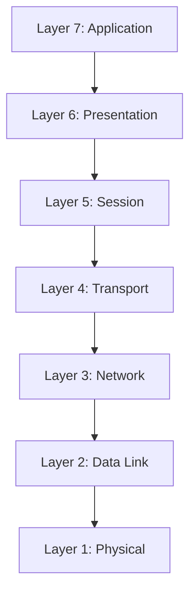

# Networking

This section introduces core networking concepts and practical guides you can use right away.

## OSI Model

The Open Systems Interconnection (OSI) model breaks network communication into seven layers.

### Layer-by-Layer Breakdown

| Layer | What it does | Common examples | Typical troubleshooting focus |
|---|---|---|---|
| **7. Application** | Provides network services directly to user applications. | HTTP/HTTPS, DNS, SMTP, SSH | Check app config, URLs, API endpoints, and service availability. |
| **6. Presentation** | Translates, encrypts, and compresses data between systems. | TLS/SSL, data encoding formats (JSON, XML) | Validate certificates, ciphers, and data format compatibility. |
| **5. Session** | Starts, manages, and ends communication sessions. | RPC sessions, NetBIOS sessions, TLS session reuse | Look for session timeouts, re-authentication loops, and handshake failures. |
| **4. Transport** | Handles end-to-end delivery, reliability, and flow control. | TCP, UDP, ports | Verify ports are open, packet loss, retransmissions, and latency. |
| **3. Network** | Routes traffic between networks using logical addressing. | IP, ICMP, routers | Check IP addressing, routing tables, gateway, and traceroute path. |
| **2. Data Link** | Moves frames across the local network and handles MAC addressing. | Ethernet, ARP, VLANs, switches | Check ARP entries, VLAN mismatches, switch port state, and MAC learning. |
| **1. Physical** | Transmits raw bits over physical media. | Cables, fiber, NICs, radio/wifi signals | Confirm link lights, cable integrity, duplex/speed mismatches, and signal quality. |

### How to Use OSI in Troubleshooting

When diagnosing connectivity issues, work from the bottom up:

1. **Layer 1-2:** Confirm physical link and local network health first.
2. **Layer 3:** Validate IP, gateway, and route path.
3. **Layer 4:** Test protocol/port reachability.
4. **Layer 5-7:** Verify session behavior, encryption, and app-level responses.

This method helps narrow root cause quickly instead of guessing across the entire stack.

## Continue Learning

- [Network Security](./network-security)
- [Network Troubleshooting](./network-troubleshooting)
